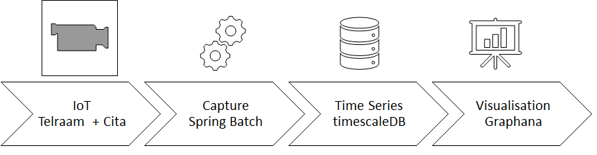

# trafic : Prédiction du flux routier


[wiki.lafabriquedesmobilites.fr/wiki/IA\_Prediction\_de\_flux\_routier](https://wiki.lafabriquedesmobilites.fr/wiki/IA_Prediction_de_flux_routier)

L&#39;objet de ce commun est de produire de la connaissance pour identifier quelles sont les conditions minimales pour alimenter une IA capable de prédire les flux de circulation à un certain horizon de temps.


# Introduction

Les données à disposition en Open Data pour cette 1ère exploration sont

- Les données du trafic des autoroutes du Luxembourg à travers 186 caméras via [www.cita.lu](http://www.cita.lu/)
- Les données de la caméra place général de gaulle (Mouans-Sartoux) via [www.telraam.net](http://www.telraam.net/)

A partir de ces données, les questions à explorer sont

- Valider l&#39;hypothèse qu&#39;il est possible d&#39;avoir une IA qui prédise les flux de circulation avec 15 minutes d&#39;avance
- Identifier le faisceau de données nécessaires pour produire une IA pertinente
- Décrire les besoins pour mettre cet algorithme en production

Ce document résume les résultats de cette analyse.

D&#39;un point de vue technique, le premier objectif est de développer une solution de captation de données, afin de valider la faisabilité et le faible cout de mise en œuvre d&#39;une telle solution à l&#39;aide des outils Open Source


# Livrables

Tous les sources sont disponibles ici : [https://github.com/fabmob/trafic](https://github.com/fabmob/trafic)

#### Analyse

Pour la partie analyse, les outils utilisés sont les librairies python de « machine learning »  [scikit-learn.org/stable/](https://scikit-learn.org/stable/) [www.tensorflow.org/](https://www.tensorflow.org/) et [keras.io/](https://keras.io/)

#### La solution pour la captation des flux [cita.lu](http://cita.lu/) et telraam se compose de :

- Un batch d&#39;alimentation : batch générique Open Source en java à l&#39;aide du Framework Spring permettant de récolter les données des caméras ([spring.io/](https://spring.io/))
- Une base de donnée de type «Time Series » (timescaledb de PostgreSQL [www.timescale.com/](https://www.timescale.com/))
- Un outil de visualisation des données (Graphana [grafana.com/grafana/](https://grafana.com/grafana/))

Les livrables pour cette solution d&#39;alimentation sont le code source (java + sql), la documentation de la mise en œuvre et des exemples de Dashboard de visualisation.


# Description des données à disposition en Open Data

## Données du trafic des autoroutes au Luxembourg

L&#39; administration des Ponts et Chaussées du Luxembourg met à disposition un ensemble de données ouvertes via la plate-forme de données luxembourgeoise [data.public.lu](http://data.public.lu/)
 ( [https://data.public.lu/fr/organizations/administration-des-ponts-et-chaussees](https://data.public.lu/fr/organizations/administration-des-ponts-et-chaussees)  )


Les données suivantes peuvent être interrogées en temps réels au format DATEX II, format de données de trafic routier (norme européenne) (DATEX II : [http://trafic-routier.data.cerema.fr/la-norme-europeenne-datex-ii-a58.html](http://trafic-routier.data.cerema.fr/la-norme-europeenne-datex-ii-a58.html) )

- Données du trafic des autoroutes
- Données des événements trafic
- Données météo

### Données du trafic des autoroutes
Pour chacune des 180 caméras sur les autoroutes (A1, A3, A4, A6, A7, A13, B40) les données suivantes sont exposées toutes les 5 minutes :
 Données :

- Identifiant de la caméra
- Timestamp de la mesure
- Sens de prise de vue
- Latitude et longitude de la caméra
- Distance de la caméra au début de l&#39;autoroute (caméra au km x )
- Vitesse moyenne en km/h
- Concentration du trafic en pourcentage
- Flux du trafic en nombre de voitures par heure

Format : XML DATEX II
 URLs A1 : [https://www.cita.lu/info\_trafic/datex/trafficstatus\_a1](https://www.cita.lu/info_trafic/datex/trafficstatus_a1)
 URL pour xx : [https://www.cita.lu/info\_trafic/datex/trafficstatus\_xx](https://www.cita.lu/info_trafic/datex/trafficstatus_xx)   avec xx dans (A1, A3, A4, A6, A7, A13, B40)

### Données des événements trafic
L&#39;API donne la liste des événements (situation) en cours.

On peut trouver les données suivantes à dispositions pour chaque situation, identifiant de la situation, timestamp de la création de la situation, position, description de l&#39;événement.
 La description complète des données disponible est décrite ici : [https://diffusion-numerique.info-routiere.gouv.fr/IMG/pdf/interface-datexii-avectipi-2017-171124.pdf](https://diffusion-numerique.info-routiere.gouv.fr/IMG/pdf/interface-datexii-avectipi-2017-171124.pdf)

Le format est en XML DATEX II
 URL : [https://www.cita.lu/info\_trafic/datex/situationrecord](https://www.cita.lu/info_trafic/datex/situationrecord)

### Données météo

L&#39;API donne des informations météos pour un ensemble de point de mesure.

- Identifiant du point de mesure
- Timestamp de la mesure
- Pourcentage d&#39;humidité
- Précipitation en mm par heure
- Température de la surface de route
- Température de l&#39;air
- Température de rosée
- Vitesse et direction du vent

Le format est en XML DATEX II
 URL : [https://www.cita.lu/info\_trafic/datex/weather\_dynamic.xml](https://www.cita.lu/info_trafic/datex/weather_dynamic.xml)

## Données du trafic place général de gaulle (mouans sartoux, France)

[https://www.telraam.net/fr/location/9000000411](https://www.telraam.net/fr/location/9000000411)


Cette caméra fait partie du dispositif Telraam qui met à disposition des citoyens intéressés des caméras de comptage. ([https://www.telraam.net/fr/what-is-telraam](https://www.telraam.net/fr/what-is-telraam))


Chaque heure la caméra relève les données suivantes :

- Pourcentage d&#39;activité de la caméra
- Comptage des piétons, voitures, vélos, camions (total, gauche et droite de la rue)
- Histogramme des vitesses des voitures pour les intervalles [0-10[  [10-20[ [20- 30[     .....  [70 et plus [

Le format est en JSON
 URLs de récupération des données : [https://telraam-api.net/v0/reports/9000000411](https://telraam-api.net/v0/reports/9000000411)

Documentation de l&#39;API : [https://telraam.zendesk.com/hc/en-us/articles/360027325572-Want-more-data-Telraam-API](https://telraam.zendesk.com/hc/en-us/articles/360027325572-Want-more-data-Telraam-API)

Remarque : ce paragraphe décrit des données disponibles utilisables pour la prédiction du trafic. Dans la suite, uniquement les données issues des caméras sont utilisées pour cette exploration (Données cita du trafic des autoroutes Lux + Données telraam du trafic place général de gaulle)

# Capture des données

## Description


La solution technique  est décrite ici [READMEBATCH.md](READMEBATCH.md)

L'idée est de capter les données décrites ci-dessus et de visualiser les données en temps réel à l'aide de dashboard


# Analyse des données du trafic des autoroutes au Luxembourg

L'ensemble de l'analyse est disponible ici [traffic-prediction-in-luxembourg.ipynb](traffic-prediction-in-luxembourg.ipynb) 

Cette analyse est publiée pour le compte de la fabmob le site de data science Kaggle : [traffic-prediction-in-luxembourg](https://www.kaggle.com/fabmob/traffic-prediction-in-luxembourg) 

## Description des données

Les données analysées ont été captées sur les 186 caméras mises à disposition en Open Data par cita.lu entre le 19/11/2019 et le 26/12/2019.

Les données de chaque caméra sont mises à jour toutes les 5 minutes.

Pour cette période, cela représente un jeu de donnée de 1 887 379 enregistrements.

Si on extrapole à 1 année, cela représente environ 18 130 000 enregistrements.

Les 3 mesures disponibles pour chaque caméra toutes les 5 minutes sont :

- La vitesse moyenne en km/h
- La concentration du trafic en pourcentage
- Le flux du trafic en nombre de voitures par heure

## Exploration graphique

Les graphiques suivants tracent ces 3 mesures pour la caméra au kilomètre 11 de l&#39;A3, cette caméra se situe à la frontière de la France et du Luxembourg. Le trafic à la frontière connait des surcharges journalières le matin vers le Luxembourg et le soir vers la France.

Vitesse moyenne en km/h sur 4 semaines (2019-11-25 au 2019-12-23) par jour, d&#39;abord vers le Luxembourg, puis vers la France


Nombre de voitures par heure sur 4 semaines (2019-11-25 au 2019-12-23) par jour, d&#39;abord vers le Luxembourg, puis vers la France


Concentration du trafic sur 4 semaines (2019-11-25 au 2019-12-23) par jour, d&#39;abord vers le Luxembourg, puis vers la France


## Prédiction d&#39;indicateurs à l&#39;aide d&#39;un algorithme de classification

Cette première analyse se concentre sur la prédiction d&#39;indicateurs. Ces trois indicateurs simples (Oui/Non) sont les suivants :

- Baisse de la vitesse de 20% (par rapport à maintenant) dans 15 minutes.
- Baisse de la vitesse de 60% (par rapport à la vitesse moyenne globale) dans 15 minutes.
- Baisse de la vitesse et du flow de 60% (par rapport à la moyenne globale) dans 15 minutes.

Ces trois indicateurs tentent de qualifier respectivement un ralentissement, un potentiel bouchon, plus surement un bouchon.

Pour entrainer le modèle, les données suivantes ont été produites à partir des observations.

A un instant t, pour une caméra,

- La vitesse moyenne en km/h
- La concentration du trafic en pourcentage
- Le flux du trafic en nombre de voitures par heure
- La vitesse moyenne pour la caméra à 1km en amont
- La concentration du trafic pour la caméra à 1km en amont
- Le flux du trafic pour la caméra à 1km en amont
- Numéro de jour de la semaine
- Weekend : Oui/Non
- Heure (01, 02, …,14, 15, …, 24)
- Evolution de la vitesse en %, entre t et (t - 5 minutes), entre (t - 5 minutes) et (t - 10 minutes) et entre (t - 10 minutes) et (t - 15 minutes)
- Evolution du flux en %, entre t et (t - 5 minutes), entre (t - 5 minutes) et (t - 10 minutes) et entre (t - 10 minutes) et (t - 15 minutes)
- Evolution de la concentration en %, entre t et (t - 5 minutes), entre (t - 5 minutes) et (t - 10 minutes) et entre (t - 10 minutes) et (t - 15 minutes)
- Moyenne pondérée exponentielle de la vitesse sur les 15 dernières minutes
- Moyenne pondérée exponentielle de la concentration sur les 15 dernières minutes
- Moyenne pondérée exponentielle du flux sur les 15 dernières minutes

Les tests préliminaires de prédiction ont apporté les deux constats suivants :

- Entrainer 1 seul modèle pour toutes les caméras en même temps ne donnent pas de bon résultat. Les dynamiques de chaque point de l&#39;autoroute sont différentes.
- Dans les variables d&#39;une observation, si on ne prend que les données de la caméra, les prédictions à 15 minutes sont peu fiables. C&#39;est pourquoi, les données de la caméra en amont ont été ajoutées.

L&#39;algorithme choisi est le « Random Forest », un algorithme de classification, basés sur l&#39;agrégation d&#39;arbre de décisions.

Les métriques utilisées pour mesurer la fiabilité des prédictions sont les suivantes :

- **Score global de prédiction**
Accuracy = Probability (correct test) = (TP+TN)/(TP+FP+TN+FN)
- **Pourcentage de prédiction correcte parmi les prédiction positives**
Precision= Probability (positive | positive test) = TP / (TP+FP)
- **Pourcentage de prédiction correcte parmi les observations négatives**
Specificity = Probability (negative test | negative) = TN / (FP+TN)


Les données ont été divisées en deux jeux :

- 80% des données sont utilisées pour entrainer le modèle (train data)
- 20% des données sont utilisées pour mesurer la fiabilité des prédictions (test data)

Et les trois indicateurs ont été testés sur toutes les caméras de l'A3 avec les résultats suivants :


> L'indicateur qui donne les meilleurs résultats est une baisse de vitesse de 60% (par rapport à la vitesse moyenne globale) en 15 minutes


# Analyse des données de la caméra telraam

L'ensemble de l'analyse est disponible ici [predict-trafic-flow-from-camera-counting.ipynb](predict-trafic-flow-from-camera-counting.ipynb) 

Cette analyse est publiée pour le compte de la fabmob le site de data science Kaggle : [predict-trafic-flow-from-camera-counting](https://www.kaggle.com/fabmob/predict-trafic-flow-from-camera-counting) 


## Description des données

Les données analysées ont été captées entre le 16/06/2020 et le 07/08/2020.

Chaque heure la caméra relève les données suivantes :

- Pourcentage d&#39;activité de la caméra
- Comptage des piétons, voitures, vélos, camions (total, gauche et droite de la rue)
- Histogramme des vitesses des voitures pour les intervalles [0-10[  [10-20[ [20- 30[     .....  [70 et plus [

Exemple :

Exemple :
```
&quot;segment\_id&quot;: &quot;9000000411&quot;,
&quot;date&quot;: &quot;2020-07-23T05:00:00.000Z&quot;,
&quot;pct\_up&quot;: 0.584444444444444,
&quot;timezone&quot;: &quot;Europe/Paris&quot;,
&quot;pedestrian&quot;: 27.3764258555133,
&quot;bike&quot;: 10.2661596958175,
&quot;car&quot;: 366.15969581749,
&quot;lorry&quot;: 11.9771863117871,
&quot;pedestrian\_lft&quot;: 15.3992395437262,
&quot;bike\_lft&quot;: 0,
&quot;car\_lft&quot;: 22.2433460076046,
&quot;lorry\_lft&quot;: 0,
&quot;pedestrian\_rgt&quot;: 11.9771863117871,
&quot;bike\_rgt&quot;: 10.2661596958175,
&quot;car\_rgt&quot;: 343.916349809885,
&quot;lorry\_rgt&quot;: 11.9771863117871,
&quot;car\_speed\_histogram&quot;: [10.2661596958175,27.3764258555133,107.794676806084,164.25855513308,34.2205323193916,11.9771863117871,5.13307984790875,5.13307984790875],
&quot;car\_speed\_bucket&quot;: [0,1,2,3,4,5,6,7]
```

Pour une année, cela représente au plus 8760 enregistrements

Cette caméra a des contraintes, car pour réaliser les comptages, elle fait de la reconnaissance d&#39;image :

- La caméra n&#39;est pas active la nuit
- La caméra n&#39;est pas active 100% du temps en plein jour c&#39;est pourquoi, le pourcentage d&#39;activité est indiqué. Lorsque la caméra est partiellement active, les comptages sont proratisés à l&#39;aide de ce pourcentage pour estimer l&#39;activité dans l&#39;heure observée.
- La caméra peut être hors de service pendant une période

La capture des données n&#39;est donc pas en continue comme on peut le voir sur le graphique de comptage des voitures sur cette période.


La stratégie pour combler les valeurs manquantes est de remplacer NaN par la moyenne à la même heure et au même jour de la semaine.


## Exploration graphique des données

A partir de l&#39;histogramme des vitesses des voitures, on peut estimer une vitesse moyenne.

#### Graphique : évolution de la vitesse moyenne


#### Graphique : maximum de la vitesse moyenne journalière


#### Graphique : médiane de la vitesse moyenne journalière


On peut aussi s&#39;intéresser dans quel sens et à quel moment de la journée la rue est-elle plus passante, en comparant le comptage des voitures à droite et à gauche.

#### Graphiques : somme totale des voitures par heure et par jour

      

On peut aussi établir des tendances journalières moyennes

#### Graphique : comptages moyens par heure et par jour :

   

## Gestion des valeurs manquantes

Pour utiliser des modèles sur ces séries de comptage, les valeurs manquantes vont être remplacées par la valeur moyenne du jour de la semaine et de l&#39;heure.

#### Graphique : série originale


#### Graphique : série ajustée


## Prédiction


# Compte kaggle pour la FabMob

User : [lafabriquedesmobilites@gmail.com](mailto:lafabriquedesmobilites@gmail.com)

Pwd :


# Description de l&#39;infrastructure


