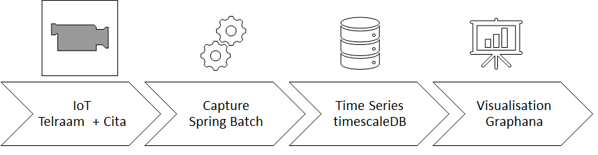

# Prototype de capture des données

## Description

La solution pour la captation des flux cita.lu et telraam se compose de :

- Un batch d'alimentation : batch générique Open Source en java à l’aide du Framework Spring permettant de récolter les données des caméras, spring.io
- Une base de donnée de type «Time Series », timescaledb de PostgreSQL www.timescale.com
- Un outil de visualisation des données, Graphana, grafana.com/grafana


## Stack technique
- Configuration Run = exécuter les éléments
- Configuration Dev = développement

Minimal Configuration :
- Docker : Run + Dev
- Java 11.0.7 : Run + Dev
- Maven : Dev
- EDI IntelliJ ou Eclipse : Dev

## Mise en oeuvre de la DB
Tous les sources sont dans trafic\batch\sql

A exécuter dans le répertoire  \batch\src :
```
################################
	Create db
	execute each command in .../batch/sql
################################
docker run -d --name traficdb -p 5432:5432 -e POSTGRES_PASSWORD=password timescale/timescaledb:latest-pg12
docker cp createEmptyDB.sql traficdb:createEmptyDB.sql
docker cp telraam.csv traficdb:telraam.csv
docker cp trafic_time.csv traficdb:trafic_time.csv
docker exec -it traficdb psql -U postgres -f createEmptyDB.sql

################################
	optional : load data
################################
docker exec -it traficdb psql -U postgres -d trafic -c "\COPY telraam FROM telraam.csv CSV"
docker exec -it traficdb psql -U postgres -d trafic -c "\COPY trafic_time FROM trafic_time.csv CSV"
```
